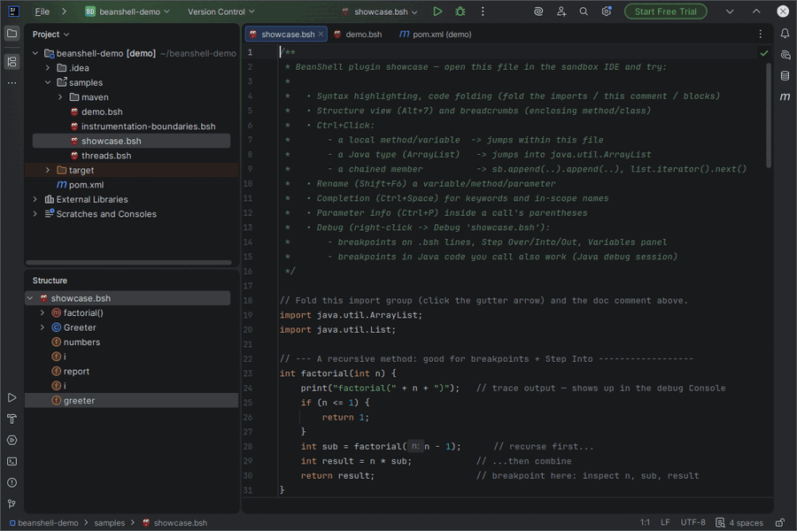
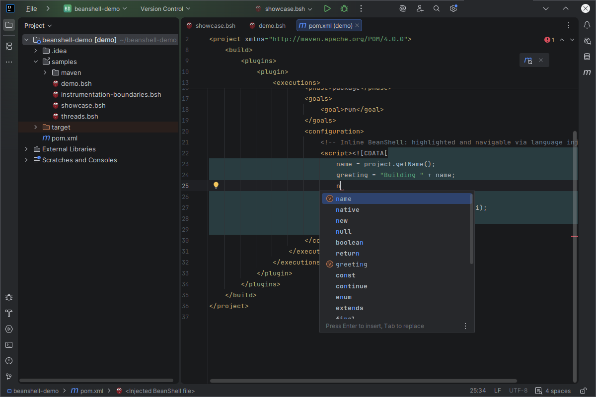
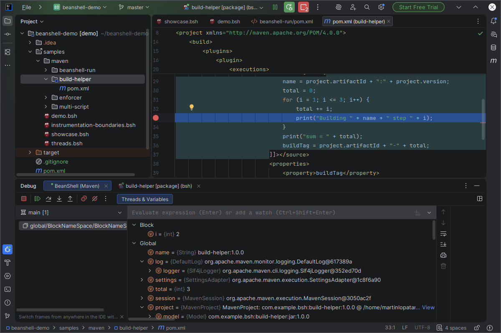

# BeanShell Tooling — Debugging & Language Support for IDEs

## IntelliJ-based IDEs plugin

JetBrains IDEA, WebStorm, CLion, and any other IntelliJ Platform IDE:

- BeanShell script recognition — `.bsh` files, a self-executing shebang, or an
  `<!--language=BeanShell-->` hint comment
- **Full language support** — a hand-written parser, syntax highlighting, code completion,
  navigation, refactoring, running scripts
- **Debugging** — breakpoints, stepping, a variables view, evaluate
- **Maven `pom.xml` injection** — the same language support and debugging for BeanShell embedded
  in a Maven plugin's `<configuration>`

## VS Code extension

Debugging a `.bsh` script over DAP: attach to a JVM already running under the agent, or let the
extension launch it for you.

## Neovim plugin

Debugging support for `nvim-dap`, over the same DAP transport.

## Eclipse

Debugging support via LSP4E's generic DAP client (attach only — nothing here can launch the
target JVM itself).

## Description

This repository is two things, built together because the second depends on the first: a
source-level debugger for BeanShell, built once as a JVM agent and exposed twice — a native
protocol for the IntelliJ plugin above, and the Debug Adapter Protocol (DAP) for VS Code, Neovim
and Eclipse. See [`agent/`](agent/README.md) for the debugger and [`plugin/`](plugin/README.md)
for the language plugin.

## Specific documentation

**If you only want the IntelliJ IDE plugin**, [`plugin/README.md`](plugin/README.md) is the
complete reference — features, requirements, installation, screenshots.

**If you want to debug BeanShell from an editor other than IntelliJ**, jump straight to
[`editors/`](#editors-vs-code-neovim-eclipse) below.

## Why a debug agent, not JDWP

BeanShell scripts are not their own class files — they are interpreted by `bsh.Interpreter`
line by line, so the JVM's own debugger (JDWP) has nothing to attach *to* at the script
level; it can only see the interpreter's Java internals. The agent instead instruments
`bsh.Interpreter` itself (via ASM, at class-load time, `-javaagent`-style) so it can suspend
a script at a source line, report locals from the interpreter's own namespace, and evaluate
expressions with the real interpreter — without modifying the script on disk or the library
that embeds it. [`agent/README.md`](agent/README.md) has the full rationale and the
landmines that came with it.

## One Gradle build, four subprojects

```
plugin/            :plugin              IntelliJ plugin -- language support and the debugger UI
agent/instrument/  :agent:instrument    bsh-debug-agent -- premain + the ASM transformer, shaded
agent/hook/        :agent:hook          bsh-debug-hook  -- the class instrumented BeanShell calls into
agent/samples/     :agent:samples       debugger fixtures; nothing ships from here
agent/checks/      --                   end-to-end agent checks, as bash scripts
editors/           --                   VS Code extension, Neovim/Eclipse configs for the DAP transport
docs/              repository-wide docs
```

**The agent is a separate subproject on purpose**: once it speaks DAP it is a debug adapter
that VS Code, Neovim or Eclipse can attach to, and none of them will take it out of an
IntelliJ plugin ZIP. The IntelliJ plugin bundles the same agent jar and talks to it over a
native protocol by default (richer — per-thread suspension, multiple simultaneous stops —
than what IntelliJ's own DAP client would support); the two protocols are just two
serializations of the same instrumentation underneath.

## The IntelliJ plugin

[`plugin/`](plugin/README.md) adds BeanShell language support to any IntelliJ-based IDE
(IDEA, WebStorm, PyCharm, CLion, …):

- **Editing** — syntax highlighting, an AST-backed structure view, code folding, brace
  matching, formatting, live/postfix templates, quick documentation.
- **Code intelligence** — a full recursive-descent parser matching the BeanShell grammar,
  Go to Declaration / Find Usages / Rename, code completion, parameter hints, inspections
  with quick fixes.
- **Java interoperability** (with the Java plugin present) — Ctrl+Click into Java classes
  and members via static type propagation across a chain, and navigation into BeanShell
  classes declared in a script.
- **Running** `.bsh` files with a bundled interpreter, and **Maven `pom.xml` injection** so
  BeanShell embedded in Maven plugin configuration (`beanshell-maven-plugin`, the enforcer's
  `evaluateBeanshell`, `build-helper-maven-plugin`, …) gets the same tooling.
- **Debugging** — line breakpoints, the call stack, Step Over/Into/Out, Run to Cursor, a
  variables view with Watches and Evaluate, all backed by the real interpreter in the
  selected frame. A companion Java (JDWP) session picks up breakpoints in Java code the
  script calls into, for free, wherever the platform already wraps the JVM (e.g. debugging
  an inline Maven script).

Full details and known limitations: [`plugin/README.md`](plugin/README.md).

### Screenshots



Click a thumbnail to open it full-size:

<p>
  <a href="plugin/docs/images/editor.png"></a>
  <a href="plugin/docs/images/completion.png"></a>
  <a href="plugin/docs/images/navigation.png"></a>
  <a href="plugin/docs/images/debugger.png"></a>
  <a href="plugin/docs/images/maven-injection.png"></a>
  <a href="plugin/docs/images/maven-completion.png"></a>
  <a href="plugin/docs/images/inspection.png"></a>
  <a href="plugin/docs/images/maven-debug.png"></a>
</p>

## Editors: VS Code, Neovim, Eclipse

The debug agent doubles as a standalone DAP debug adapter (`-Dbsh.debug.protocol=dap`), so
editors with their own DAP client can debug BeanShell without the IntelliJ plugin at all:

- [`editors/vscode/`](editors/vscode/README.md) — a VS Code extension with a `launch.json`
  contribution and a `.bsh` language id. Supports both `attach` (to a JVM already running
  under the agent) and `launch` (the extension starts that JVM itself).
- [`editors/neovim/`](editors/neovim/README.md) — configuration for `nvim-dap`, the same
  transport.
- [`editors/eclipse/`](editors/eclipse/README.md) — configuration for Eclipse's generic DAP
  client, attach-only (Eclipse's client has no scriptable way to launch the debuggee itself).

What DAP doesn't cover yet — conditional/function/exception breakpoints, step-back,
restart-frame — is listed honestly in the adapter's own capabilities rather than silently
ignored; see [`docs/PROTOCOL.md`](docs/PROTOCOL.md#9-relationship-to-dap).

## Building

Run from the repository root:

```bash
JAVA_HOME=<jdk17+> ./gradlew build              # everything, with tests
JAVA_HOME=<jdk17+> ./gradlew :plugin:test
./gradlew :agent:instrument:shadowJar           # the agent jar alone
```

The plugin needs **JDK 17+** (Gradle refuses less) and compiles Kotlin to 21. The agent
targets **Java 8**, because it loads into whatever JVM hosts BeanShell — a per-task
`options.release`, not a build-wide property.

```bash
./agent/checks/run-all.sh                       # the agent, end to end
```

`agent/checks/` runs what a JVM test cannot arrange from inside itself: a real `mvn`
process (so a real plugin realm), a JVM launched with `-javaagent`, and two processes
talking over the debug socket. Run it after touching the agent or the wire protocol — see
[`agent/checks/README.md`](agent/checks/README.md) for what each check protects.

## Where to read first

- [`agent/README.md`](agent/README.md) — the debug agent: why an agent rather than
  JDWP, how the transformer works, the landmines, the wire protocol.
- [`plugin/README.md`](plugin/README.md) — the IntelliJ plugin's features,
  requirements and installation.
- [`plugin/docs/ARCHITECTURE.md`](plugin/docs/ARCHITECTURE.md) — the language plugin
  (lexer, parser, PSI, resolution, completion).
- [`plugin/docs/DEBUGGING.md`](plugin/docs/DEBUGGING.md) — the IDE side of debugging,
  and which of the three instrumentation implementations runs.
- [`docs/PROTOCOL.md`](docs/PROTOCOL.md) — the debug wire protocol, in full.
- [`docs/FUTURE_WORK.md`](docs/FUTURE_WORK.md) — open work, ordered by what blocks
  what.
- [`docs/BEANSHELL-DEFECTS.md`](docs/BEANSHELL-DEFECTS.md) — upstream bugs in
  BeanShell 2.0b6 that a debugger runs into.

## License

Apache License 2.0 — see [`plugin/LICENSE`](plugin/LICENSE) and
[`plugin/NOTICE`](plugin/NOTICE). BeanShell itself is developed by the
[Apache BeanShell](https://beanshell.github.io/) project.

[dap]: https://microsoft.github.io/debug-adapter-protocol/specification
