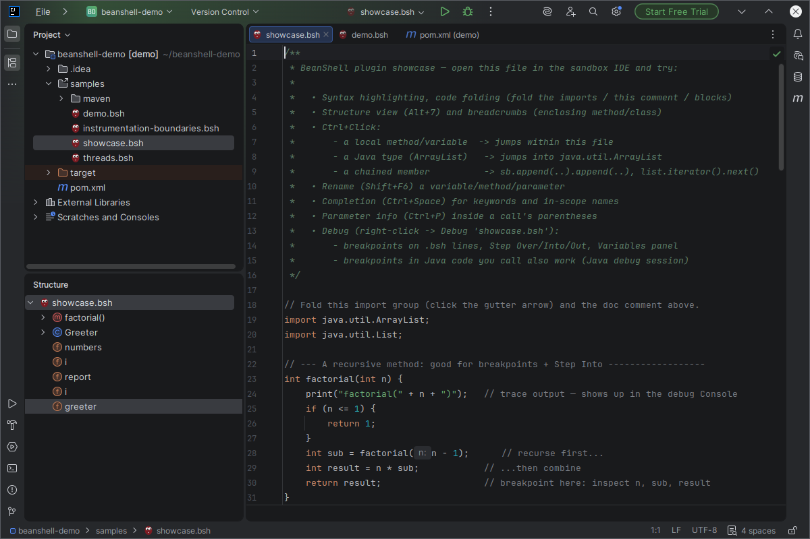
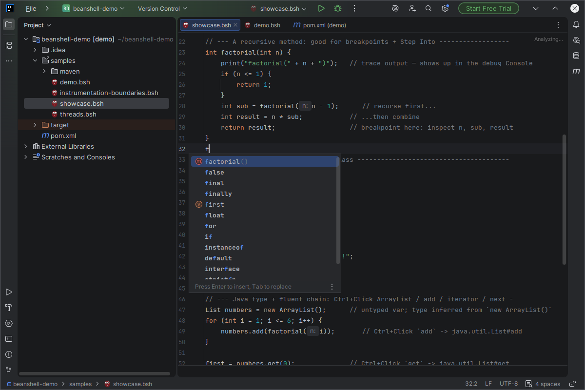
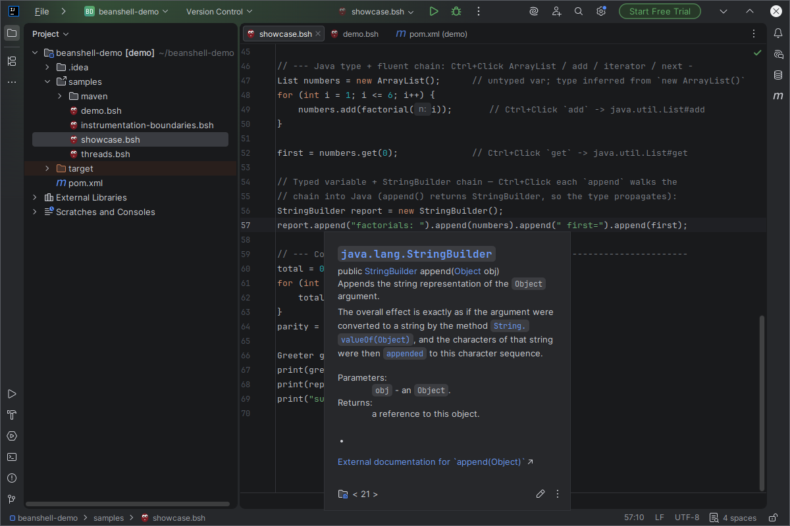
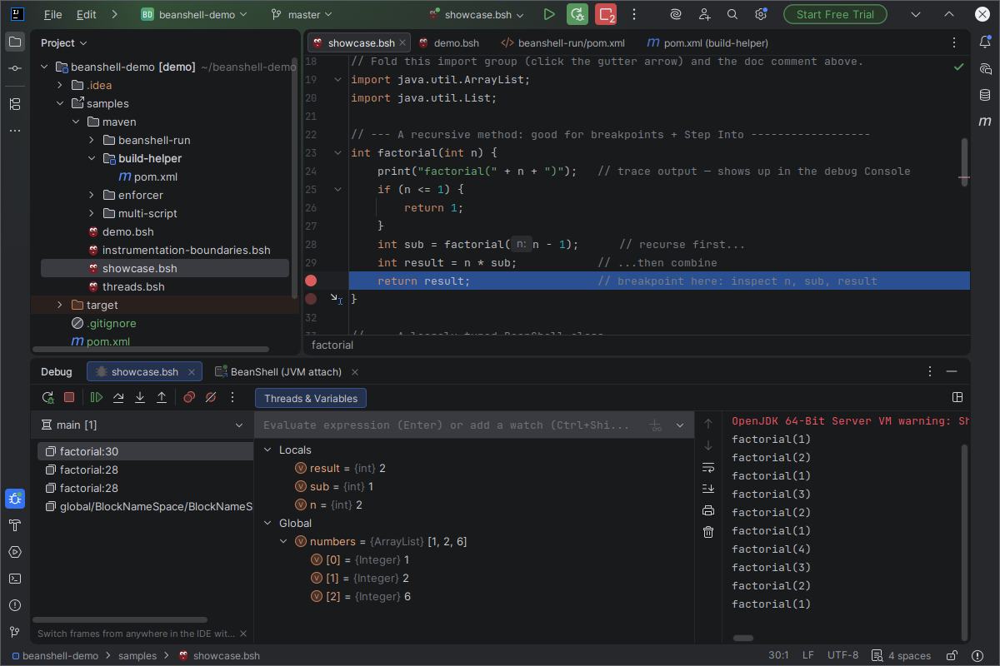
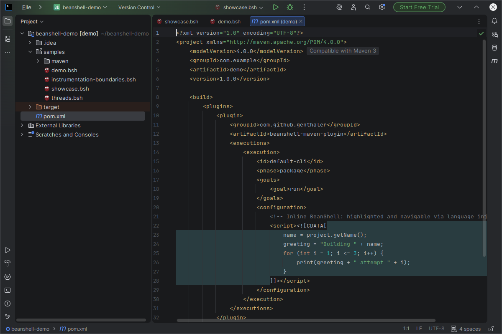
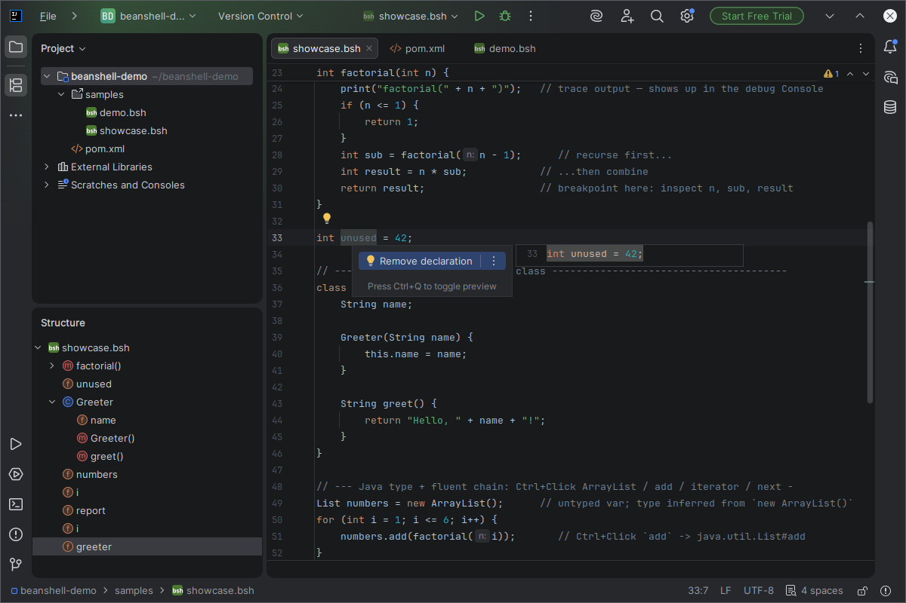

# BeanShell Language Support for IntelliJ-based IDEs

Language support for [BeanShell](https://beanshell.github.io/) scripts (`.bsh`):
a full syntax tree, code intelligence, running, and a source-level debugger — plus
BeanShell recognition inside Maven `pom.xml` configuration and XML in general.

The core runs in **any IntelliJ-based IDE** (IDEA, WebStorm, PyCharm, CLion, …);
Java-aware features — navigation into Java code, variable type inference and
JVM-debugger attach — light up in **IntelliJ IDEA** and other IDEs that bundle the
Java plugin.

The language model follows the
[**BeanShell 2.0b6**](https://github.com/beanshell/beanshell/tree/2.0b6) grammar
([`bsh.jjt`](https://github.com/beanshell/beanshell/blob/2.0b6/src/bsh/bsh.jjt)),
which is the version published to Maven Central and bundled with the plugin for
running scripts out of the box.

> Documentation index: [Architecture](docs/ARCHITECTURE.md) ·
> [Debugging internals](docs/DEBUGGING.md)

## Features

### Editing
- **Syntax highlighting** with a configurable color scheme
  (*Settings → Editor → Color Scheme → BeanShell*).
- **Code folding** of `{ }` blocks, block/doc comments, and consecutive imports.
- **Brace matching**, line/block **commenting**, and an indentation **formatter**
  (*Reformat Code*).
- **Structure view** (Alt+7) and **breadcrumbs** for the enclosing class/method.
- **Read/write highlighting** of the variable under the caret.
- **Quick documentation** (Ctrl+Q) for declarations, including a preceding
  Javadoc-style comment.
- **Live templates** (`sout`, `fori`, `iter`, `ifn`, `whn`, `mdef`) and
  **postfix templates** (`.sout`, `.if`, `.while`).
- **Surround With** (Ctrl+Alt+T): `if`, `while`, `try/catch`.
- **TODO** highlighting inside comments.

### Code intelligence
- A **full AST parser** (recursive descent with backtracking) that mirrors the
  BeanShell grammar and reports syntax errors as you type.
- **Go to Declaration / Find Usages / Rename** for methods, classes, typed and
  untyped variables, and parameters; methods and classes also resolve across the
  project's `.bsh` files.
- **Code completion** for keywords and in-scope names.
- **Parameter info** (Ctrl+P) and **inlay parameter-name hints** at call sites.
- **Inspections** with quick fixes: unused variable/parameter, unreachable code,
  and (opt-in) unresolved method call.
- **Introduce Variable** intention and **Go to Symbol** (Ctrl+Alt+Shift+N).

### Java interoperability *(requires the Java plugin — optional)*
- **Ctrl+Click into Java**: class names (FQN, `java.lang.*`, imported), and
  members reached through **static type propagation** across a chain, e.g.
  `report.append("x").append("y")` or `list.get(0)`.
- **BeanShell class members**: `greeter.greet()` navigates to the `greet`
  method of a `Greeter` class declared in the script.

### Running
- A **BeanShell run configuration**; right-click a `.bsh` file → *Run*.
- The interpreter is **bundled** (`org.apache-extras.beanshell:bsh:2.0b6`), so
  scripts run with no setup; the classpath is overridable per configuration.
- Uses the **project JDK** when available (falls back to the IDE runtime).

### Debugging
- A **source-level debugger** for `.bsh` files: line breakpoints, the call stack,
  Step Over / Into / Out, and Run to Cursor
  (see [docs/DEBUGGING.md](docs/DEBUGGING.md)).
- A **variables view** that expands nested objects, collections, maps and arrays,
  plus **Watches**, the **Evaluate** dialog, and **Set Value** on a variable — all
  evaluated by the real interpreter in the selected frame.
- Two instrumentation mechanisms, chosen per run configuration: a **JVM agent**
  that leaves the script on disk untouched (default), or **rewriting** the script,
  which needs no agent jar and no JVM flag but shows one frame and cannot evaluate.
- With the Java plugin present, breakpoints in the **Java code** called from a
  script are honored by a companion Java (JDWP) debug session.

### File recognition & injection
BeanShell is recognized in several ways:
- files with the **`.bsh`** extension;
- extensionless scripts whose **shebang** launches BeanShell, including the
  self-executing polyglot (`#!/bin/sh` … `exec java bsh.Interpreter "$0"`);
- inline scripts in the **`<configuration>`** of specific Maven plugins
  (see below);
- any XML element preceded by a **`<!--language=BeanShell-->`** comment.

## Maven inline scripts

Several Maven plugins accept an inline BeanShell script in their configuration.
BeanShell is injected into those properties (in `pom.xml`) so the full tool-chain
works inside them. The curated list lives in
[`src/main/resources/beanshell/maven-scripts.txt`](src/main/resources/beanshell/maven-scripts.txt)
and is easy to extend — one line per property:

```
# <artifactId> | <propertyTag> | <direct|nested>
beanshell-maven-plugin     | script    | direct
maven-enforcer-plugin      | condition | nested
build-helper-maven-plugin  | source    | direct
```

`direct` means the property is a direct child of `<configuration>`; `nested`
allows it deeper (e.g. the enforcer's `<rules><evaluateBeanshell><condition>`).

## Requirements & compatibility

- IntelliJ IDEA (or a compatible IDE) **2025.3**.
- Optional, all wired so the plugin still loads when absent:
  - **Java plugin** — Java navigation and the Java debug session;
  - **XML** — Maven/XML injection;
  - **Spellchecker** — spell-checking of comments and strings.

## Installation

- **From disk:** build the ZIP (see below), then in the IDE go to
  *Settings → Plugins → ⚙ → Install Plugin from Disk…* and pick
  `plugin/build/distributions/*.zip`. Restart when prompted.
- **From source:** `./gradlew :plugin:runIde` launches a sandbox IDE with the plugin
  pre-installed.

## Building & running

Run from the repository root — the plugin is the `:plugin` subproject:

```bash
./gradlew :plugin:buildPlugin   # build the distributable ZIP (plugin/build/distributions)
./gradlew :plugin:runIde        # launch a sandbox IDE with the plugin
./gradlew :plugin:test          # run the test suite
```

## Examples

- [`samples/showcase.bsh`](samples/showcase.bsh) — exercises most features and is
  annotated with what to click (navigation, chains, debugging).
- [`samples/demo.bsh`](samples/demo.bsh) — a smaller recursion + collection
  example, handy for trying breakpoints and stepping.

Inline BeanShell inside a `pom.xml`, for debugging a script as a real Maven build
runs it (create a "bsh-enhanced Run Configuration" from the Maven tool window and
launch it in Debug):

- [`samples/maven/beanshell-run`](samples/maven/beanshell-run) — a single inline
  `<script>` run by the genthaler beanshell-maven-plugin.
- [`samples/maven/multi-script`](samples/maven/multi-script) — two inline scripts
  in one build; a single BeanShell debug tab stops in each at the right pom line.
- [`samples/maven/enforcer`](samples/maven/enforcer) and
  [`samples/maven/build-helper`](samples/maven/build-helper) — the enforcer
  `<condition>` and build-helper `<source>` forms.

## Screenshots

|                                                     |                                               |
|-----------------------------------------------------|-----------------------------------------------|
|                    |      |
| Syntax highlighting & Structure view                | Code completion (keywords + in-scope names)   |
|            |          |
| Quick documentation into Java on a chained member   | Debugger: variables + console at a breakpoint |
|  |      |
| BeanShell injected into `pom.xml`                   | Inspection quick-fix for an unused variable   |

## Known limitations

- The parser targets the **2.0b6** grammar; 3.0-only syntax (`**`, `??`, `<=>`,
  triple-quoted strings, word operators such as `@gt`) is tokenized by the lexer
  but not all of it is parsed.
- Java navigation is **static**: it follows types that are evident in the code
  (typed variable/parameter, `= new Type()`, class names). Generic element types,
  array indexing and runtime-only types are not inferred.
- On JDK 9+, BeanShell 2.0b6 cannot reflectively access some JDK-internal
  iterators, so `list.iterator().next()` / `for (x : list)` may fail at runtime —
  a property of the interpreter, not the plugin. Index-based iteration works.

## License & credits

This plugin is licensed under the [Apache License 2.0](LICENSE).

BeanShell is developed by the [Apache BeanShell](https://beanshell.github.io/)
project. This plugin bundles `org.apache-extras.beanshell:bsh:2.0b6` (also under
the Apache License 2.0) for running and (optionally) resolving scripts; see
[NOTICE](NOTICE) for attribution.
